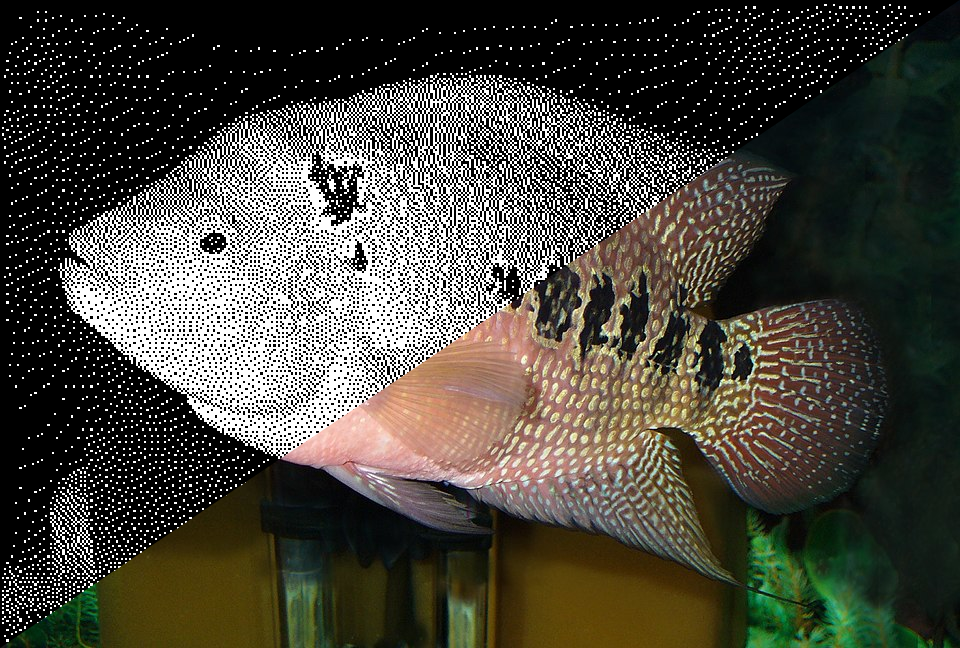

## ThermPrinter Assistant


___
### Infos
ThermPrinter Assistant converts a bitmap image into a **1-bit black & white image** specifically prepared for thermal printers.  
The application computes the correct pixel density so that **one image pixel maps exactly to one printed dot**. This guarantees correct scaling and predictable print results across different printers and paper widths.

To operate correctly, the software requires:  
- **Printer DPI** (Dots Per Inch)
- **Paper width**, expressed in inches  


After resizing, the image is processed using:
- Conversion to 1-bit monochrome (black & white)
- Contrast & brightness adjustment
- Optional dithering

### Notes 
To get the best printing results please **disable any automatic pre-printing image processing on your OS**, such as ICM profiles on windows.

Images generated by this software **can't be processed again** by the application.  
Once converted, color information is permanently reduced to a single bit per pixel, making reprocessing invalid.

___

## Building

### Dependencies
| Package     | Note                    |
|-------------|-------------------------|
| Pillow      | Image processing        |
| PyQt6       | GUI                     |
| Colorama    | Debug                   |
| pyinstaller | Compilation (optionnal) |


### Installing dependencies
```bash
# Linux
python -m venv .venv
source .venv/bin/activate
pip install -r requirements.txt
```
```pwsh
# Windows
py -m venv .venv
.\.venv\Scripts\Activate.ps1
pip install -r requirements.txt
```

### Compiling
#### Linux
```bash
# GUI
pyinstaller --onefile --add-data "samples/sample.jpg:samples" --add-data "icons/printer3d.ico:icons" --add-data "icons/logo.ico:icons" --name "ThermPrinter_Assistant" scripts/gui/main.py

# TUI
pyinstaller --onefile --name "ThermPrinter_Assistant_TUI" scripts/tui/main.py     

# Converter
pyinstaller --onefile --name "cm_inch_converter" scripts/cm_inch_convert.py
```


#### Windows
```pwsh
# GUI
pyinstaller --onefile --noconsole --icon=icons\printer3d.ico --add-data "samples\sample.jpg;samples" --add-data "icons\printer3d.ico;icons" --add-data "icons\logo.ico;icons" --name "ThermPrinter_Assistant" .\scripts\gui\main.py

# TUI
pyinstaller --onefile --icon=icons\printer2d.ico --name "ThermPrinter_Assistant_TUI" .\scripts\tui\main.py     

# Converter
pyinstaller --onefile --name "cm_inch_converter" .\scripts\cm_inch_convert.py
```


